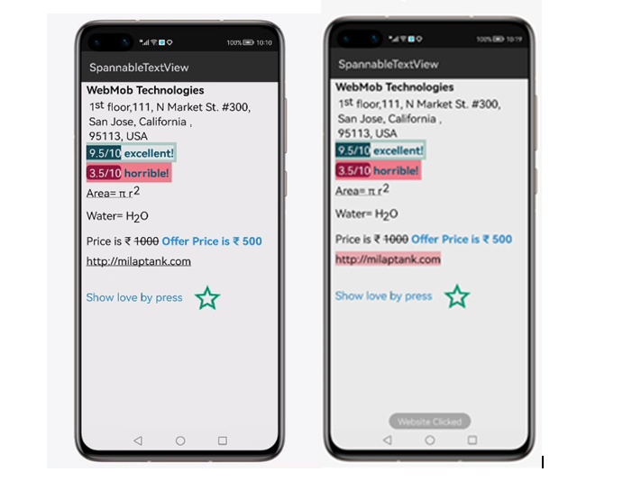

 ## Screenshot

 
 &nbsp;&nbsp;&nbsp;&nbsp;&nbsp;&nbsp;&nbsp;&nbsp;&nbsp;&nbsp;&nbsp;&nbsp;&nbsp;&nbsp;&nbsp;&nbsp;

###### SpannableTextView is a custom `TextView` which lets you customize the styling of slice of your text or statment via `Spannables`, but without the hassle of having to deal directly with Spannable themselves.

Add this in your build.gradle

dependencies{
   compile 'com.milaptank:stv:1.0.0'
}

## What can I do with SpannableTextView?
Examples of different styles.

## Screenshot

 
 &nbsp;&nbsp;&nbsp;&nbsp;&nbsp;&nbsp;&nbsp;&nbsp;&nbsp;&nbsp;&nbsp;&nbsp;&nbsp;&nbsp;&nbsp;&nbsp;


Example
--------
Generate the following style:

## Screenshot

 
 &nbsp;&nbsp;&nbsp;&nbsp;&nbsp;&nbsp;&nbsp;&nbsp;&nbsp;&nbsp;&nbsp;&nbsp;&nbsp;&nbsp;&nbsp;&nbsp;

With the code below:

```java
stvMarksDown.addSlice(new SpannableStyles.Builder(this.getResourceManager()
                    .getElement(ResourceTable.String_stvMarksDown).getString())
                    .backgroundColor(RgbPalette.parse(this.getResourceManager()
                    .getElement(ResourceTable.Color_customized_burgundy).getString()))
                    .textColor(Color.WHITE.getValue())
                    .setCornerRadius(13)
                    .build());
            stvMarksDown.display();
            stvMarksDownText.addSlice(new SpannableStyles.Builder(this.getResourceManager()
                    .getElement(ResourceTable.String_stMrksDTxt).getString())
                    .textColor(RgbPalette.parse(this.getResourceManager()
                    .getElement(ResourceTable.Color_customized_darkblue).getString()))
                    .style(Font.BOLD)
                    .build());
            stvMarksDownText.display();
```

What kind of styles can I add?
--------
Right now you can customize the style of your text by using the following methods, which internally
get converted to the corresponding `spannableS`

| SpannableTextView         | Internal Span           |
| ------------- |:-------------:|
| textSize      | setTextSize() |
| textColor      | setTextColor()      |
| textSizeRelative | RelativeSizeSpan      |
| style | setTextFont()      |
| underline | setUnderline()      |
| strike | setStrikethrough()      |

What else can I do?
--------
Once you've created and displayed your SpannableTextView, you can modify the text contents of each
`SpannableStyles` individually. For example, if we want to change the `3.5/10` from the above example into
`6/10`, we could do the following:

```java
{
      "name": "stvMarksDown",
      "value": " 6/10   "
}
```
### Contributing to SpannableTextView
All pull requests are welcome.
